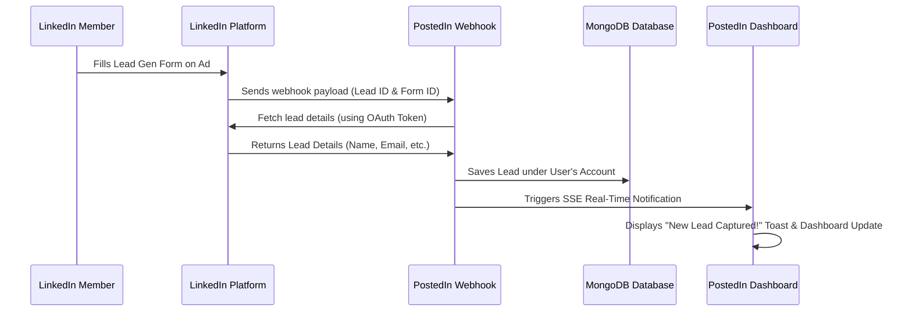

# PRD: LinkedIn Advertising, Lead Sync & Conversions Integration

## 1. Overview & Objectives
Currently, **PostedIn** is an organic content engine that helps developers and creators build their personal brands through daily automated posts, carousels, and dashboards. 

To expand PostedIn into a **full-funnel B2B marketing suite**, this future integration will allow users to transition high-performing organic posts into paid ad campaigns, capture customer leads directly on LinkedIn, and track end-to-end conversions—all from the PostedIn dashboard.

### Core Objectives
1. **Ad Campaign Creation & Boosting**: Enable users to "Boost" top-performing organic posts directly as Sponsored Content.
2. **Automated Lead Synchronization**: Real-time sync of leads captured via LinkedIn Lead Gen Forms to PostedIn's Lead Dashboard.
3. **Conversion Attribution**: Connect landing page signups and sales back to specific LinkedIn Ads using the Conversions API.

---

## 2. Target Audience & Use Cases
* **SaaS Founders & Indie Hackers**: Who want to sponsor their launch posts and capture early signups.
* **Freelancers & Agency Owners**: Who write educational content and want to capture inbound client leads through ads.
* **Developer Relations (DevRel) Teams**: Sponsoring technical webinars and capturing registration leads.

---

## 3. Scope & Feature Requirements

### Phase 1: Post Boosting (Advertising API)
Allows users to launch Sponsored Content ad campaigns directly from the PostedIn dashboard.
* **Ad Account Linkage**: View and connect LinkedIn Ad Accounts (`/adAccountUsers`).
* **One-Click Boost**: "Boost Post" button on any generated/published post in the feed.
* **Campaign Settings Drawer**: Configure daily budget, schedule, target audience (job titles, industries, locations), and bidding type.
* **Ad Analytics**: Basic performance tracking (impressions, clicks, spend, CTR) displayed directly on the post card.

### Phase 2: Lead Sync Dashboard (Lead Sync API)
Synchronizes leads captured through LinkedIn Lead Gen Forms in real time.
* **Lead Gen Form Mapping**: Connect specific lead forms associated with a company page or ad campaign.
* **Real-time Webhook Ingestion**: Webhook handler at `/api/linkedin/leads/webhook` that catches lead events and parses them.
* **Leads Dashboard (New Tab)**:
  - Display list of leads: Name, Email, Job Title, Company, Date, and Source Campaign.
  - Export capabilities (CSV/Excel).
  - Integration webhooks (forward leads to Zapier, HubSpot, or Slack).

### Phase 3: Attribution & ROI (Conversions API)
Tracks conversions (signups, newsletter subscriptions, purchases) on the user's external website.
* **PostedIn Pixel/Conversion Webhook**: A lightweight API token given to the user to trigger conversion events from their landing page backend.
* **LinkedIn Conversions API Sync**: Instantly send offline or server-side conversion events back to LinkedIn's `/conversions` API.
* **ROI Dashboard**: Correlate ad spend with actual conversions, showing metrics like Cost Per Lead (CPL) and Customer Acquisition Cost (CAC).

### Phase 4: Social Inbox & Page Messaging (Pages Data Portability API)
Enables B2B page admins to manage and sync all engagement metrics, user replies, and page direct messages directly from the dashboard.
* **Social Inbox**: Fetch and display post comments (`/dmaComments`) and reactions (`/dmaReactions`) in real-time.
* **Page Messaging Sync**: Retrieve page direct messages and thread history (`/dmaPageMessagingMessages` & `/dmaPageMessagingThreads`) to read inbound user inquiries.
* **Engaged Users Analytics**: Match active commentators with potential CRM leads, subject to their LinkedIn privacy permissions.
* **Page Notification Hub**: Pull company page alerts (e.g. mentions, page follows) via the Notification and Follow APIs.

---

## 4. Technical Architecture & System Flow

### Required LinkedIn OAuth Scopes
To enable these features, the application must request additional OAuth scopes during the connection phase:
* `rw_ads`: Create and manage advertising campaigns, budgets, and creatives.
* `r_ads_reporting`: Fetch performance metrics (impressions, clicks, spend).
* `r_leadgen_reporting`: Pull lead metadata and lead details from forms.
* `r_dma_admin_pages_content`: Access company page feed posts, comments, reactions, and visitor analytics under EU DMA guidelines.

### System Diagram (Lead Sync & Ingestion)


---

## 5. Database Schemas (New Models)

### `AdCampaign.js`
Tracks user-promoted posts and connected ad campaigns.
```javascript
const AdCampaignSchema = new mongoose.Schema({
  userId: { type: String, required: true, index: true },
  adAccountId: { type: String, required: true },
  campaignId: { type: String, required: true, unique: true },
  postId: { type: String, required: true }, // References organic Post model
  budget: { type: Number, required: true },
  status: { type: String, default: "ACTIVE" }, // ACTIVE, PAUSED, COMPLETED
  spend: { type: Number, default: 0 },
  clicks: { type: Number, default: 0 },
  impressions: { type: Number, default: 0 }
}, { timestamps: true });
```

### `Lead.js`
Stores synchronized leads.
```javascript
const LeadSchema = new mongoose.Schema({
  userId: { type: String, required: true, index: true },
  leadId: { type: String, required: true, unique: true },
  formId: { type: String, required: true },
  campaignId: { type: String, required: true, index: true },
  name: { type: String, required: true },
  email: { type: String, required: true, lowercase: true, trim: true },
  jobTitle: { type: String, default: "" },
  companyName: { type: String, default: "" },
  submittedAt: { type: Date, required: true }
}, { timestamps: true });
```

---

## 6. UI/UX Specifications

### 1. The "Boost Post" Interface
* **Trigger**: A "Boost" button next to "Post to LinkedIn" on the main feed page.
* **Component**: A right-side drawer containing:
  - Ad account selector dropdown.
  - Daily Budget slider (Min: $5/day).
  - Target Industry multi-select tags (e.g., Software Development, Financial Services).
  - Estimated Daily Reach counter (dynamic calculations).
  - "Launch Ad Campaign" submit button.

### 2. Leads Management Dashboard
* **Trigger**: A new "Leads" tab in the left sidebar menu (controllable via the new tool visibility settings).
* **Sections**:
  - **Summary Metrics**: Total Leads, Conversion Rate (Leads/Ad Clicks), Average Cost Per Lead.
  - **Leads Table**: Paginated list with search and filter inputs (filter by Campaign, Date, Job Title).
  - **Integrations Panel**: Toggle buttons to connect external CRMs (Zapier, HubSpot, Notion).

---

## 7. Risks & Mitigation
* **Verification Delays**: LinkedIn requires rigorous business verification for Standard Ad APIs, which can take weeks.
  - *Mitigation*: Enable Development Tier features with mock data for local testing while submitting the verification video to LinkedIn.
* **Rate Limits**: The Development Tier limits ad account fetches to 100/day.
  - *Mitigation*: Cache ad campaigns and settings in the local database and only refresh when the user clicks "Sync" or during a daily background cron job.
